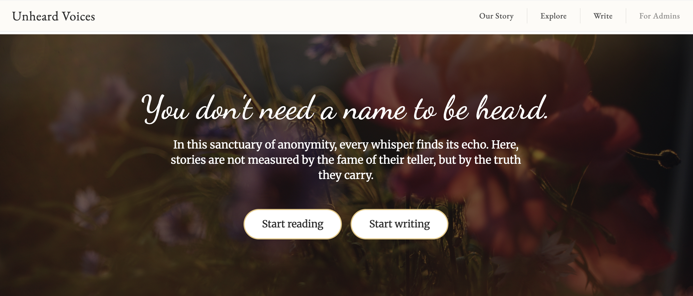
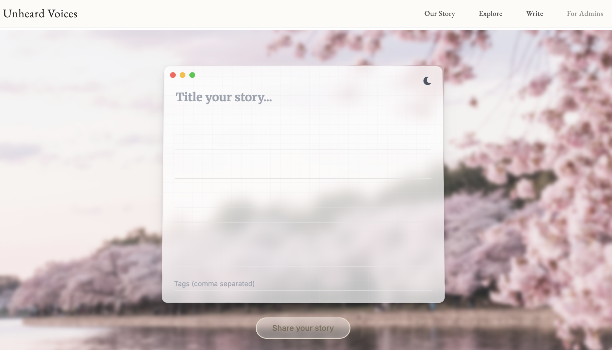
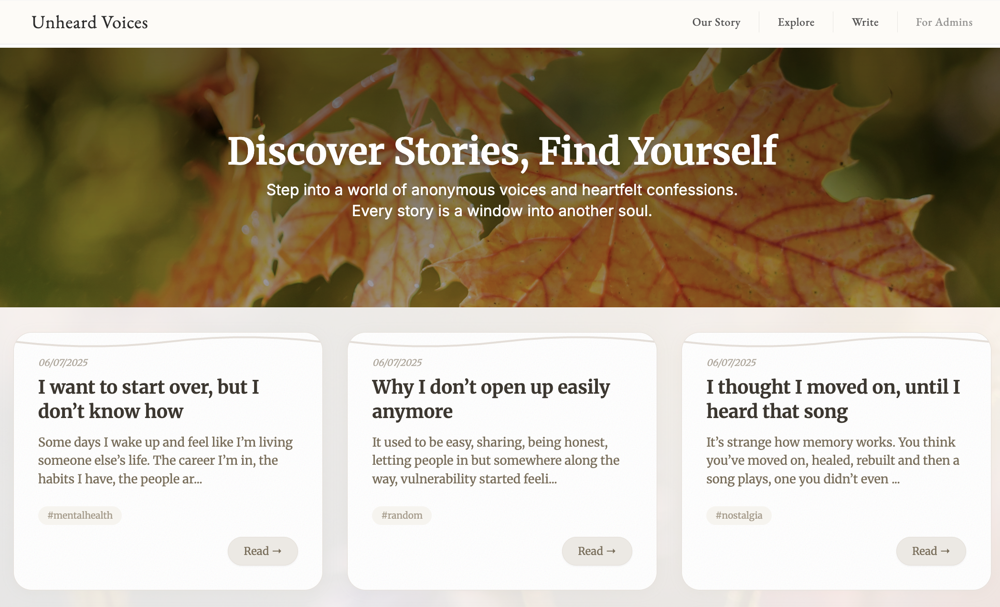

<!--
██████╗░░█████╗░██╗░░░██╗██╗░░░██╗██╗░░░░░██╗░░░██╗░█████╗░██╗░░░██╗███████╗░██████╗
██╔══██╗██╔══██╗██║░░░██║██║░░░██║██║░░░░░██║░░░██║██╔══██╗██║░░░██║██╔════╝██╔════╝
██████╦╝██║░░██║██║░░░██║██║░░░██║██║░░░░░██║░░░██║██║░░██║██║░░░██║█████╗░░╚█████╗░
██╔══██╗██║░░██║██║░░░██║██║░░░██║██║░░░░░██║░░░██║██║░░██║██║░░░██║██╔══╝░░░╚═══██╗
██████╦╝╚█████╔╝╚██████╔╝╚██████╔╝███████╗╚██████╔╝╚█████╔╝╚██████╔╝███████╗██████╔╝
╚═════╝░░╚════╝░░╚═════╝░░╚═════╝░╚══════╝░╚═════╝░░╚════╝░░╚═════╝░╚══════╝╚═════╝░
-->

  

  <h1 style="font-family:EB Garamond,serif; font-size:2.5rem; letter-spacing:2px; color:#2c2c2c;">Unheard Voices</h1>
  
<em>Where the ineffable finds utterance, and the unheard is finally heard.</em>

---

## A Sanctuary for the Seldom Spoken

Welcome to **Unheard Voices**—a digital sanctum for the unvarnished, the uncelebrated, and the unspoken. Here, the cacophony of metrics and the tyranny of trends are banished, replaced by a tranquil agora where candour and vulnerability are not merely permitted, but venerated. Whether you are a writer, a reader, or a wanderer in search of solace, you will find here a tapestry of narratives woven from the gossamer threads of sincerity and introspection.

### For the Literary Artisan

Unshackle your thoughts from the procrustean bed of perfection. Here, your words—be they nascent or nuanced—are received with equanimity. Relinquish the performative, embrace the authentic, and let your narrative meander as it must.

  

### For the Discerning Reader

Traverse a compendium of stories unencumbered by artifice. Each tale, whether a mere whisper or a resounding declaration, is imbued with the quiet dignity of truth. Let these words, unpretentious and unfiltered, find their echo in the chambers of your own experience.

  

### For the Peripatetic Soul

If you seek connection, comprehension, or simply a moment’s respite from the relentless tumult of the quotidian, you are entreated to linger. Here, empathy is currency, and understanding is the lingua franca.

---

## Our Covenant

- **Anonymity as Aegis:** Your identity is sacrosanct. Every story is posted sans attribution; your privacy is inviolable.
- **No Surveillance, No Subterfuge:** We eschew analytics, eschew commodification, and abjure the pursuit of virality.
- **Gentle Stewardship:** Moderation is exercised with a velvet glove—firm yet compassionate—to preserve the sanctity of this space.

---

## The Ethos We Uphold

- **Reverence for every utterance.**
- **Anonymity above all—never divulge identities.**
- **Support, never censure.**
- **Authenticity, tempered with mindfulness.**
- **Zero tolerance for vitriol or explicitness.**

---

## Before You Share

- Is this a distillation of your genuine experience?
- Might your words resonate, console, or illuminate?
- Have you expunged all vestiges of personal identification?

---

## When You Are Ready

> We are here to listen. Whether your heart needs to speak, or simply to rest, you are always welcome here.

---

  <i>Unheard Voices is a labour of care. Add your voice to the quiet chorus.</i>

 
